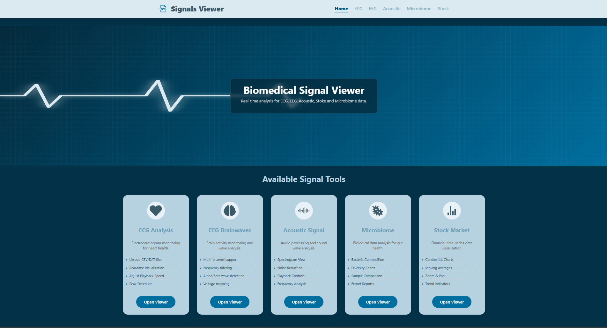
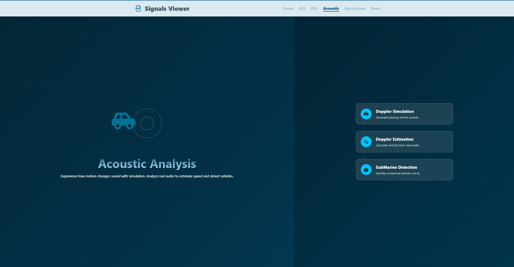
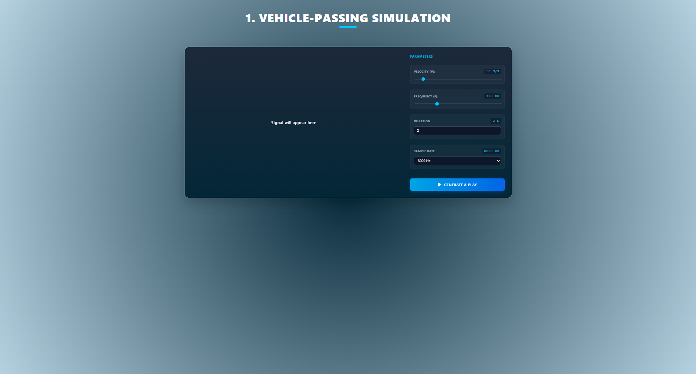
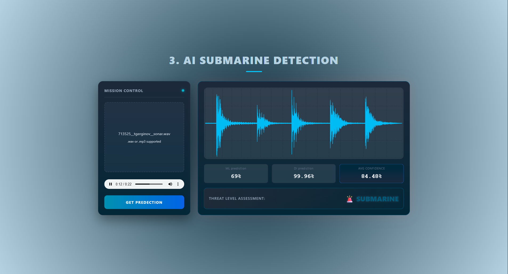
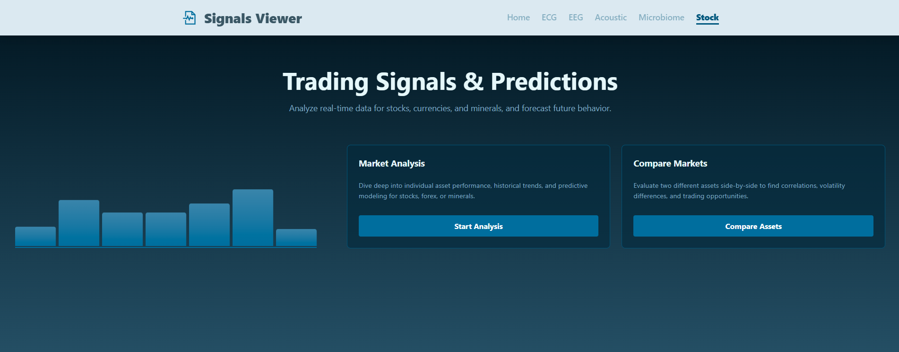
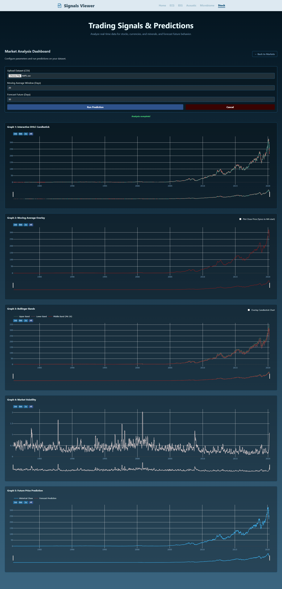
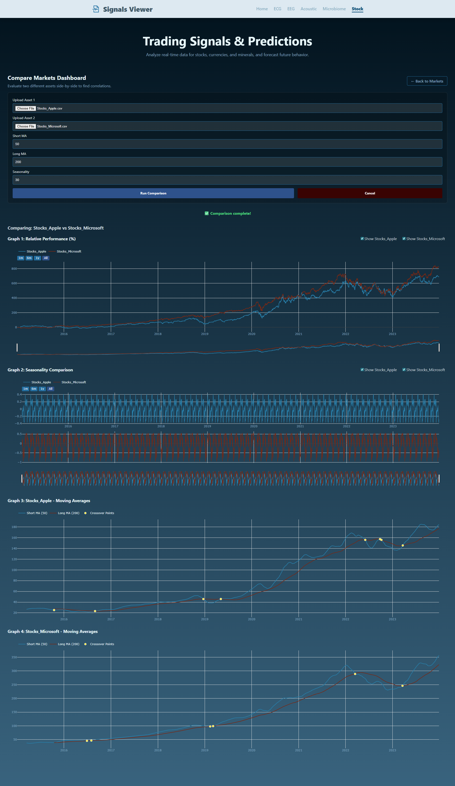
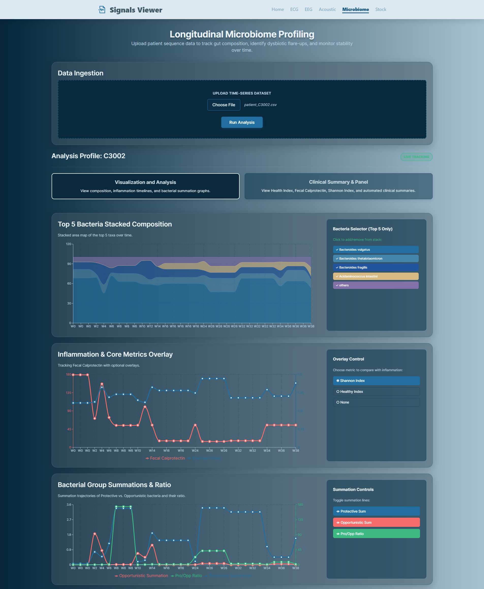
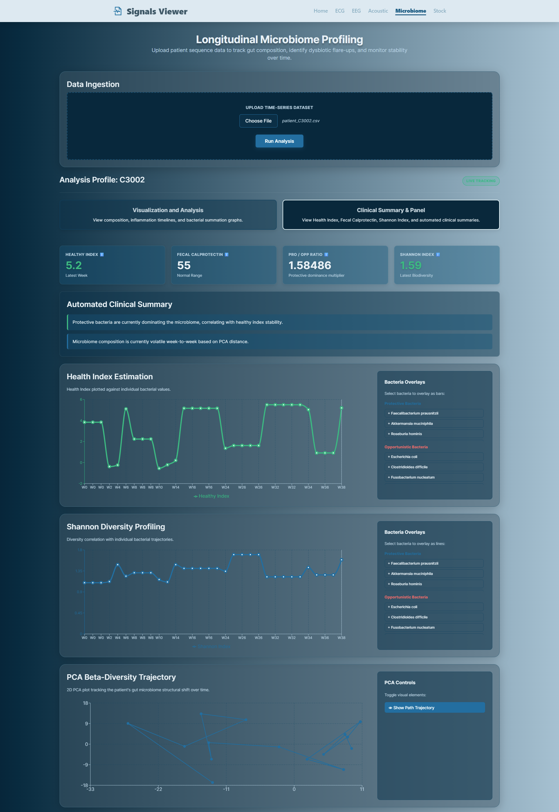

# Biomedical Signal Viewer

### One platform. Five sectors. Real signal intelligence.


Biomedical Signal Viewer unifies **acoustic, microbiome, market, EEG, and ECG workflows** in one full-stack app.

- 🎛️ **Frontend:** React + Vite
- ⚡ **Backend:** FastAPI + modular services
- 📊 **Visualization:** Plotly + Recharts
- EEG page is now an interactive dashboard (intro, launch flow, multi-view visualizers, AI result banner)
- ECG page is now fully interactive with upload, viewer sections, and dual-model diagnosis flow
- ECG backend routes are connected and live (`/ecg/upload`, `/ecg/predict`)
- README media references now reflect currently available screenshots/videos

### Why it stands out

- 🔗 **Unified workflow:** upload, analyze, and visualize in one place
- 🧠 **Cross-domain intelligence:** biomedical + acoustic + market analytics together
- 🚀 **Demo-ready modules:** Acoustic, Market, and Microbiome are ready to run now

---

## At a Glance

| Sector | Frontend | Backend | Status |
|---|---|---|---|
| Acoustic | ✅ | ✅ | Ready |
| Market | ✅ | ✅ | Ready |
| Microbiome | ✅ | ✅ | Ready |
| EEG | ✅ | ✅ | Ready |
| ECG | ✅ | ✅ | Ready |


> Shows the main navigation cards and entry points for all five modules, letting users jump directly to Acoustic, Market, Microbiome, EEG, or ECG workflows.

🎬 **Watch Demo:** [Home Walkthrough](docs/media/videos/home-walkthrough.mp4)

<video controls width="100%" src="docs/media/videos/home-walkthrough.mp4">
  Your browser does not support the video tag.
</video>

---

## Architecture

```text
React (Vite)
   |
   | HTTP (axios)
   v
FastAPI (Uvicorn)
   ├── Acoustic_Signals
   ├── Market
   ├── MicroBiome
  ├── EEG
  └── ECG
```

Local endpoints:

- Frontend: `http://127.0.0.1:5173`
- Backend: `http://127.0.0.1:8000`
- API docs: `http://127.0.0.1:8000/docs`

---

## Explore by Sector

### 1) Acoustic (`/acoustic`) — Motion, sound, and detection

End-to-end acoustic workflows:

- **Doppler Simulation** → `POST /doppler_generation`
- **Velocity/Frequency Estimation** (`.wav/.mp3`) → `POST /extract_coef`
- **AI Submarine Detection** (`.wav/.mp3`) → `POST /submarine_detection`

Outputs: waveform visualization, estimated coefficients, ML/DL confidence, and final threat label.


> Shows the Acoustic module hub with feature cards for Doppler Simulation, Doppler Estimation, and Submarine Detection, plus section-based in-page navigation.


> Shows Doppler signal generation inputs (motion/frequency settings) and the produced waveform output used to inspect simulated pass-by behavior.


> Shows audio upload-driven submarine classification with model confidence values and final detection label for threat interpretation.

🎬 **Watch Demo:** [Acoustic Demo](docs/media/videos/acoustic-demo.mp4)

<video controls width="100%" src="docs/media/videos/acoustic-demo.mp4">
  Your browser does not support the video tag.
</video>

### 2) Market (`/stock`) — Analyze trends, compare assets, predict movement

Two quantitative dashboards:

- **Single Asset Analysis** (`POST /analysis`)
  - OHLC candlestick, MA overlay, Bollinger Bands, volatility, future forecast
- **Compare Two Assets** (`POST /compare`)
  - Relative performance, seasonality, crossover analysis


> Shows market analysis setup controls where users choose files/assets and configure parameters before running single-asset or comparative analysis.


> Shows single-asset outputs including OHLC/candlestick view, moving-average overlays, Bollinger bands, volatility context, and forecast segment.


> Shows pairwise market comparison with relative trend behavior, crossover relationships, and seasonality-oriented comparison visuals.

🎬 **Watch Demo:** [Market Demo](docs/media/videos/market-demo.mp4)

<video controls width="100%" src="docs/media/videos/market-demo.mp4">
  Your browser does not support the video tag.
</video>

### 3) Microbiome (`/microbiome`) — Track gut dynamics over time

Longitudinal profiling from `.csv/.tsv` uploads via `POST /microbiome`.

Core insights:

- Top taxa stacked composition
- Fecal calprotectin overlays
- Protective vs opportunistic bacteria trends
- Health/Shannon index signals
- PCA trajectory with stability insights


> Shows core microbiome analytics: taxa composition over time, dominant bacteria distribution, and timeline-based community pattern changes.


> Shows clinical indicators and interpretive features such as inflammation markers, diversity/stability signals, and health-oriented summary panels.

🎬 **Watch Demo:** [Microbiome Demo](docs/media/videos/microbiome-demo.mp4)

<video controls width="100%" src="docs/media/videos/microbiome-demo.mp4">
  Your browser does not support the video tag.
</video>

### 4) EEG (`/eeg`) — Interactive dashboard + AI pipeline

- Interactive frontend includes intro, launch/upload flow, and multiple viewers (Continuous, Reoccurrence, Polar, XOR).
- API supports analysis and prediction extraction: `POST /EEG` (`.csv/.parquet`).
- Signal pagination endpoint is available: `GET /EEG/data/{file_id}` with `page` and `limit`.
- Screenshot and demo clip are pending upload.

EEG feature highlights on the page:

- Intro/launch step that starts analysis after successful file upload.
- AI notification banner showing top detected class and confidence percentage.
- Multi-view navigation via EEG navbar: Continuous, Reoccurrence, Polar, and XOR viewers.
- Shared prediction dictionaries (ML + DL) passed to viewers for consistent interpretation.
- Paginated signal retrieval pattern for large EEG files to keep UI responsive.

### 5) ECG (`/ecg`) — Interactive diagnostics + model selection

- Frontend supports upload, viewer navigation (ECG, XOR, Recurrence, Polar), and diagnosis display.
- Backend routes are active under `/ecg`.
- `POST /ecg/upload` parses and prepares ECG signal payloads.
- `POST /ecg/predict` supports `pretrained` and `classical` model inference.
- Screenshot and demo clip are pending upload.

ECG feature highlights on the page:

- Hero + model cards for selecting `pretrained` or `classical` diagnosis mode.
- Upload workspace for `.csv/.zip` ECG files with `Upload & Analyze` action.
- `Run Diagnosis` flow that returns per-class probability outputs.
- Quick-scroll cards to viewer sections: ECG Viewer, XOR Viewer, Recurrence Plot, Polar Viewer.
- Unified visualization workspace where uploaded signal data is reused across all ECG viewers.

---

## API Quick Reference

Fast endpoints, organized by domain:

### Acoustic

- `POST /doppler_generation` → generated signal + time arrays
- `POST /extract_coef` → `velocity`, `frequency`, sampled `signal`
- `POST /submarine_detection` → ML/DL/mixed confidence + `label`

### Market

- `POST /analysis?ma_window=&pred_steps=` → OHLC, MA, Bollinger, volatility, forecast
- `POST /compare?ma_short=&ma_long=&season_period=` → pairwise trend metrics

### Microbiome

- `POST /microbiome` → participant profile, indices, top taxa, PCA

### EEG

- `POST /EEG` → extracted features + prediction dictionaries
- `GET /EEG/data/{file_id}?page=&limit=` → paginated EEG time-series chunks

### ECG

- `POST /ecg/upload` → parsed ECG channels/metadata for visualization
- `POST /ecg/predict` → model-based diagnosis probabilities (`pretrained` or `classical`)

---

## Quick Start

Run backend + frontend in under 3 minutes.

### Prerequisites

- Python 3.10+
- Node.js 18+
- npm

### Backend

```bash
cd backend
python -m venv .venv
.\.venv\Scripts\Activate.ps1
pip install -r requirements_back.txt
uvicorn app.main:app --reload --host 127.0.0.1 --port 8000
```

### Frontend

```bash
cd frontend
npm install
npm run dev
```

---

## Data & Media Paths

- Market sample data: `backend/app/Market/test_data/`
- Microbiome sample data: `backend/app/MicroBiome/test_patients/`
- Acoustic models/assets: `backend/app/Acoustic_Signals/notebook/`
- Media checklists:
  - `docs/media/README.md`
  - `docs/media/screenshots/README.md`
  - `docs/media/videos/README.md`

---

## Troubleshooting

- **CORS issues:** run frontend on `localhost:5173` or `127.0.0.1:5173`
- **File parsing errors:** verify extension matches endpoint requirements
- **Model inference errors:** verify acoustic model files exist in `backend/app/Acoustic_Signals/notebook/`
- **No charts:** check backend is running and inspect browser network calls

---

## Roadmap

Next high-impact upgrades:

- Add EEG and ECG screenshots/demo clips to media gallery
- Improve model configuration via frontend environment variables
- Add auth + analysis history
- Add API/UI automated tests
